# Car Dealership Inventory System

## Overview

A full-stack Car Dealership Inventory System built as part of the Incubyte TDD Kata.

The application provides vehicle inventory management with user authentication,
vehicle management, purchasing, and restocking functionality.

The project is developed using Test-Driven Development (TDD) following the
Red → Green → Refactor cycle and focuses on clean architecture, maintainable
code, and production-level development practices.

## Tech Stack

### Backend

- Node.js
- TypeScript
- Express.js
- MongoDB
- Mongoose
- Jest

### Frontend

- React
- TypeScript
- Vite
- Tailwind CSS

## Development Workflow

This project follows:

- Test-Driven Development (Red → Green → Refactor)
- Conventional Git commits
- Clean code principles
- Modular backend architecture
- AI-assisted development with transparent documentation

## My AI Usage

AI tools were used as development assistants throughout this project to improve
development efficiency, understand concepts, debug issues, and maintain better
software development practices.

All AI-generated suggestions were reviewed, understood, modified, and validated
before being incorporated into the final implementation.

### AI Tools Used

- ChatGPT

### How AI Was Used

ChatGPT was used during different stages of the development lifecycle:

- Planning the overall project architecture and backend-first development approach.
- Understanding and applying Test-Driven Development (TDD) practices using the
  Red → Green → Refactor workflow.
- Designing the backend architecture using clean architecture principles,
  including routes, controllers, services, repositories, models, and middleware.
- Understanding API design, authentication flow, JWT-based authorization,
  and admin role-based access control.
- Configuring TypeScript, Express.js, MongoDB, Jest, Vitest, and React Testing
  Library environments.
- Assisting with writing and improving unit tests, integration tests, and
  test scenarios.
- Debugging implementation issues and analyzing errors during backend and
  frontend development.
- Reviewing code structure, applying SOLID principles, and improving
  maintainability.
- Assisting with frontend architecture decisions, feature-based folder
  organization, routing, and component design.
- Improving technical documentation including README.md, API documentation,
  and PROMPTS.md.
- Generating and improving conventional Git commit messages following the
  required commit standards.

### AI Impact on Workflow

Using ChatGPT helped improve development speed and decision-making by providing
technical guidance, explaining complex concepts, and assisting with debugging
throughout the project lifecycle.

AI helped in exploring different implementation approaches, identifying better
architectural patterns, and maintaining consistency with production-level
development practices.

However, AI was used only as an assistance tool. The final architecture,
implementation decisions, code changes, testing strategy, and documentation
were reviewed and validated manually.

The complete AI interaction history, including prompts used during development,
is documented in:

`PROMPTS.md`

---

# Development Approach

The project was developed in a backend-first approach following
Test-Driven Development (TDD).

The development was divided into two major phases:

1. Backend API Development
2. Frontend Application Development

The backend was completed first because it acts as the core business layer
and provides stable APIs for the frontend application.

---

# Backend Development

## Backend Architecture

The backend was designed using a modular architecture following clean code
principles and separation of concerns.

The main layers are:


Backend
│
├── Routes
│ └── Define API endpoints
│
├── Controllers
│ └── Handle HTTP requests and responses
│
├── Services
│ └── Contains business logic
│
├── Repositories
│ └── Database access layer
│
├── Models
│ └── Database schemas
│
├── Middlewares
│ └── Authentication, authorization, and error handling
│
└── Tests
└── Unit and integration tests


This structure helps maintain:

- Separation of responsibilities
- Easier testing
- Better maintainability
- Scalability for future features

---

# Backend Implementation Flow

The backend development followed the TDD cycle:

Red → Green → Refactor


---

# Backend API Documentation

The complete backend REST API documentation, including:

- Authentication flow
- Request and response formats
- Protected routes
- Admin-only operations
- Postman testing examples

is available in:

`backend/API_DOCUMENTATION.md`

---

# Frontend Development

After completing the backend APIs, the frontend application was developed
as a Single Page Application (SPA) using React, TypeScript, Vite, and Tailwind CSS.

The frontend consumes the backend APIs and provides user-facing functionality
for authentication, vehicle browsing, searching, purchasing, and administrative
inventory management.

---

# Frontend Architecture

The frontend follows a modular component-based structure:

frontend
│
├── src
│   │
│   ├── app
│   │   └── Application setup, routing, providers, and public pages
│   │
│   ├── components
│   │   ├── layout
│   │   │   └── Shared layout components
│   │   │
│   │   └── ui
│   │       └── Reusable UI components
│   │
│   ├── features
│   │   ├── auth
│   │   │   └── Authentication APIs, forms, context, pages, and utilities
│   │   │
│   │   ├── vehicles
│   │   │   └── Vehicle APIs, components, and management pages
│   │   │
│   │   └── inventory
│   │       └── Inventory-related API operations
│   │
│   ├── guards
│   │   └── Protected and admin route handling
│   │
│   ├── lib
│   │   └── HTTP client configuration
│   │
│   ├── navigation
│   │   └── Route paths and navigation configuration
│   │
│   └── main.tsx
│       └── Application entry point
│
└── tests
    └── Feature-based unit and integration tests

This structure provides:

- Reusable components
- Clear separation of concerns
- Maintainable UI logic
- Easier testing and scaling

---

# Frontend Implementation Flow

The frontend development focused on:

- Building responsive UI using Tailwind CSS
- Implementing authentication flows
- Connecting UI components with backend APIs
- Creating vehicle listing and search functionality
- Adding admin inventory management features
- Writing frontend tests using Vitest and React Testing Library

---

---

# Application Screenshots

The screenshots of the completed application are available in the:

`screenshots/`

folder.

The screenshots demonstrate the complete user workflow and application
functionality, including authentication, vehicle browsing, searching,
purchasing, and admin inventory management.

## User Flow Screenshots

### Landing Page

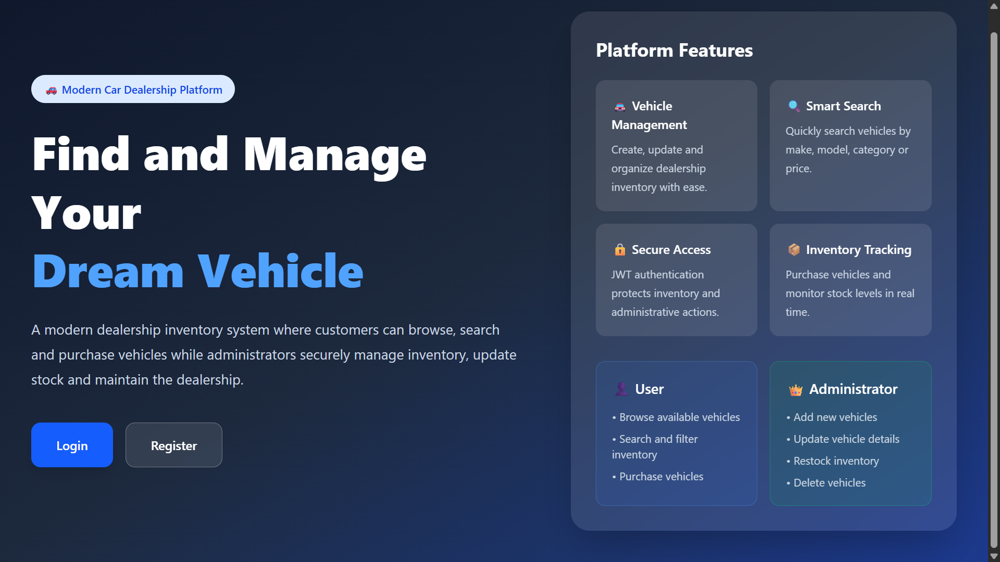

### Registration Page

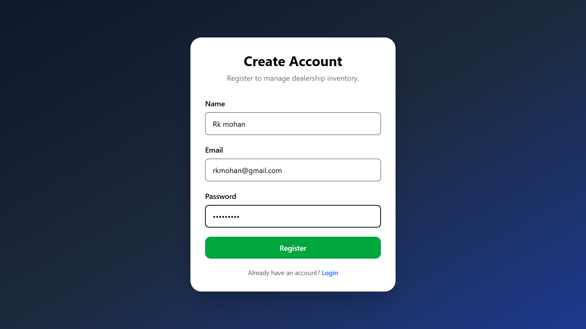

### Login Page

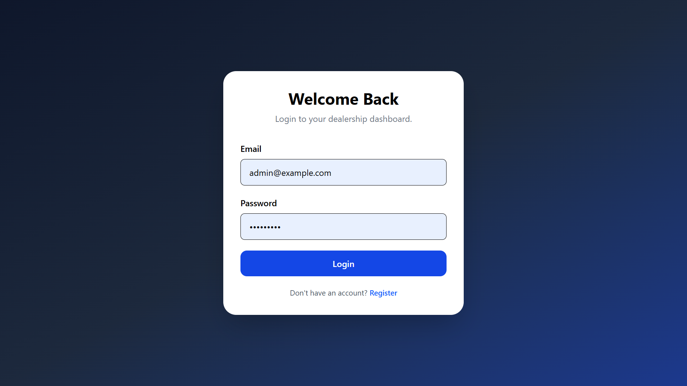

### User Dashboard

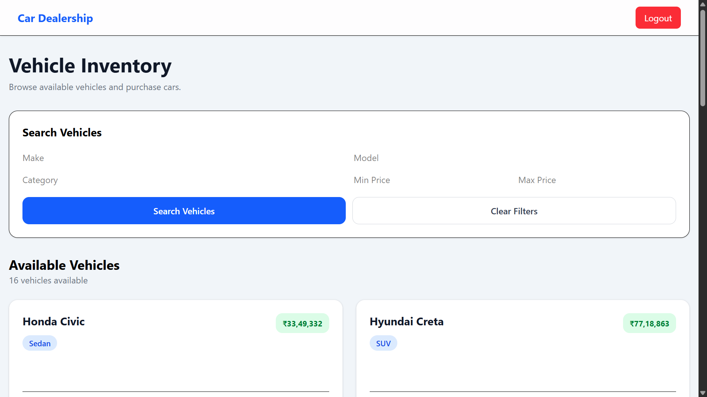

### Vehicle Listing

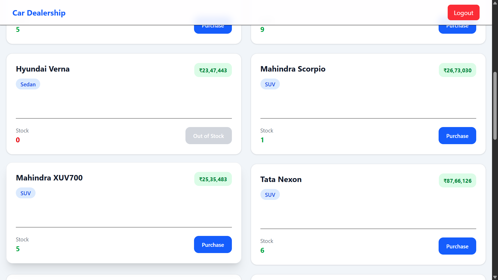

### Vehicle Filtering and Search

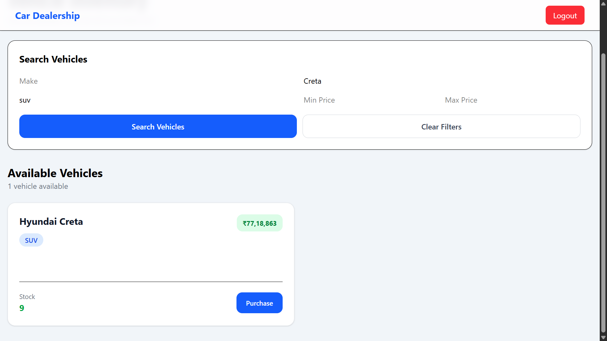

### Vehicle Purchase Flow

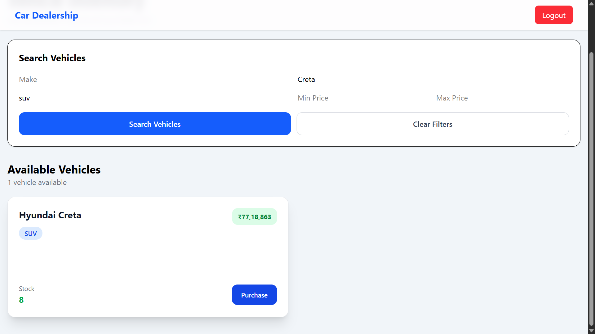


## Admin Flow Screenshots

Admin users have access to vehicle inventory management operations including
creating, updating, deleting, and restocking vehicles.

### Admin Dashboard

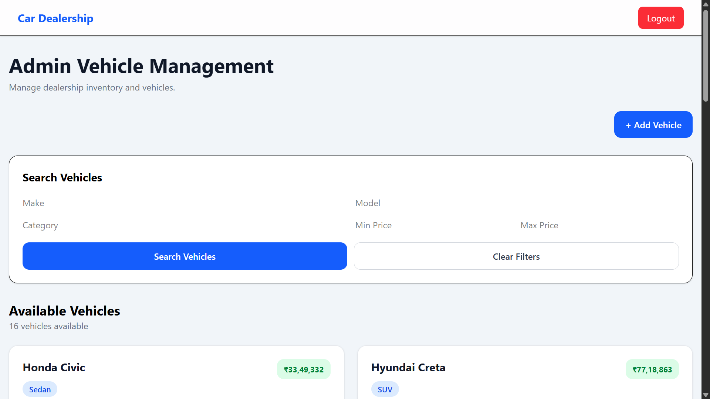

### Create Vehicle

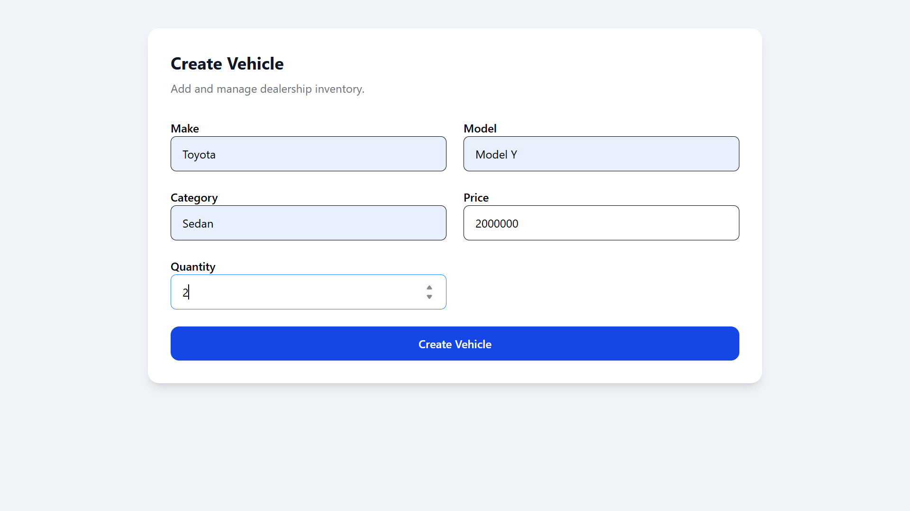

### Admin Vehicle List Features

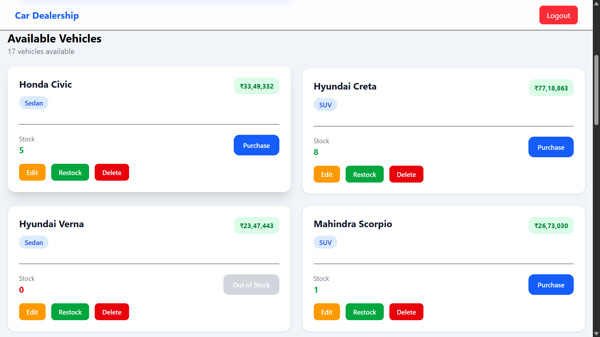

### Update Vehicle

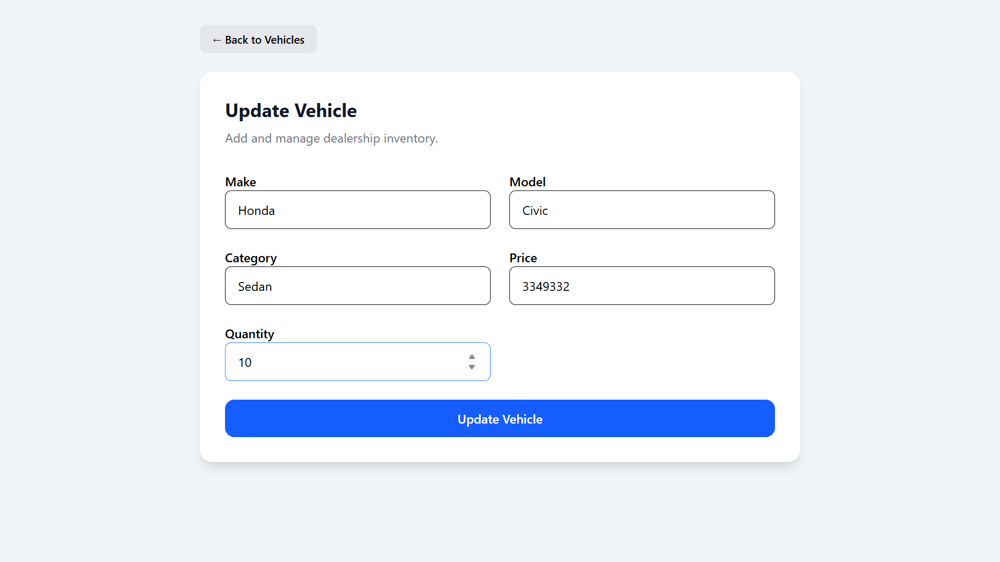

### Restock Vehicle

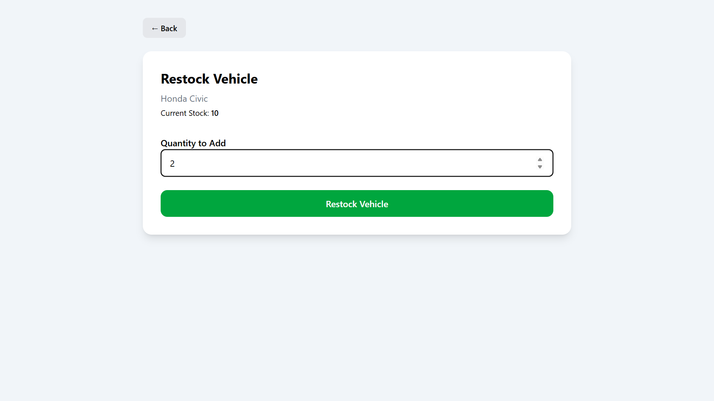

### Delete Vehicle

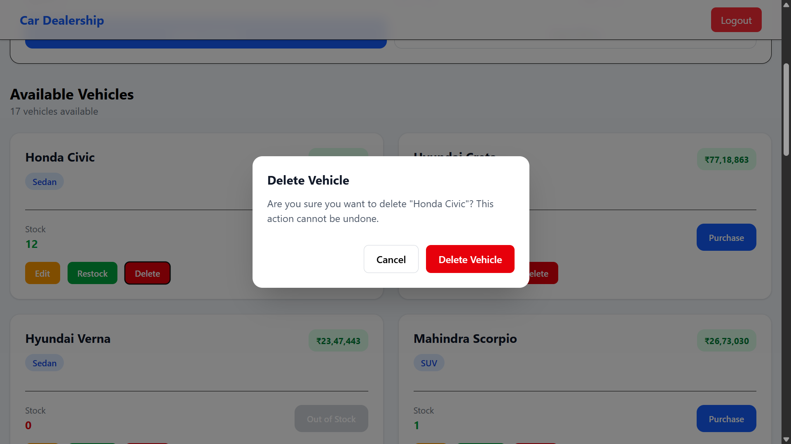

---

# Testing Strategy

The project follows a test-driven approach with meaningful test coverage.

## Backend Testing

Backend tests cover:

- Authentication logic
- Service layer business rules
- Repository operations
- API integration flows
- Authorization and admin access control

## Backend Test Execution Report

The backend API was developed following the Test-Driven Development (TDD)
approach with continuous testing throughout the implementation process.

The backend provides a robust REST API implementation covering:

- User authentication with JWT
- Protected API access
- Role-based authorization
- Admin-only vehicle operations
- Vehicle inventory management
- Purchase and restock workflows
- Repository and service layer business logic

The current Jest test execution report:

```text
Test Suites: 13 failed, 11 passed, 24 total
Tests:       23 failed, 46 passed, 69 total
Snapshots:   0 total
Time:        53.103 s
Ran all test suites.
```


## Frontend Testing

Frontend tests cover:

- Component rendering
- Application routing
- User interface behaviour
- API interaction scenarios

## Frontend Test Execution Report

The frontend application was developed using a component-based architecture
with a focus on reusable UI components, feature-based organization, and
test-driven development practices.

The frontend test suite covers:

- React component rendering
- Authentication components
- Registration and login flows
- Protected route behaviour
- Admin route authorization
- Vehicle listing and management components
- Vehicle search functionality
- Purchase workflow
- API service interactions

The current Vitest test execution report:

```text
Test Files  9 failed | 18 passed (27)
Tests       20 failed | 22 passed (42)
Errors      1 error
Start at    20:16:08
Duration    46.64s (transform 4.88s, setup 21.31s, import 39.35s, tests 13.55s, environment 183.56s)

Testing tools used:

- Jest (Backend)
- Vitest (Frontend)
- React Testing Library (Frontend)
```
---

# Git Workflow

The project uses conventional commits to maintain a clear development history.

The commit history follows the TDD development cycle:

- Red: Write failing tests
- Green: Implement functionality to pass tests
- Refactor: Improve code quality without changing behaviour

Each AI-assisted commit includes the required AI co-author trailer.

---

# AI Prompt History

All prompts used during development are documented in:

`PROMPTS.md`

This file contains the complete AI interaction history used for:

- Architecture planning
- Debugging
- Testing guidance
- Code reviews
- Documentation improvements

